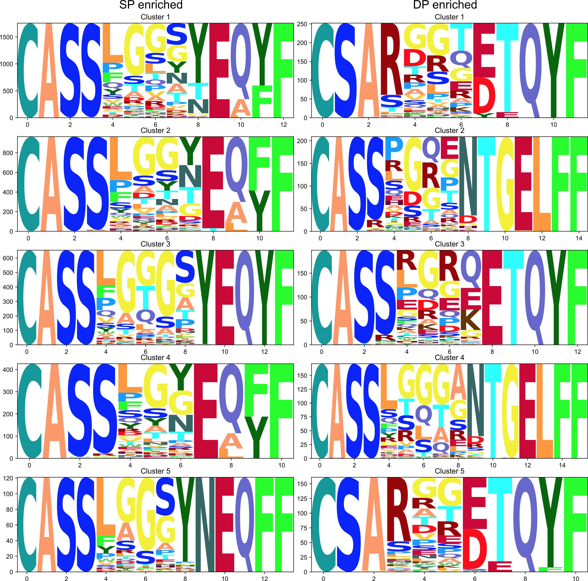

# Thymic selection motifs database

In this repository database of enriched and depleted by thymic selection motifs is stored. 
The CDR3 sequences are presented at Motifs folder. PWMs of enriched and depleted cluster are presented at PWM folder.

# Clusters Logos

## TCR beta. Naive vs. modeled
CDR3 for this logos can be found in naive_beta_enriched.tsv and naive_beta_depleted.tsv files. 

## TCR beta. Single Positive (SP) vs. Double Positive (DP) thymocites.  
CDR3 for this logos can be found in thymocytes_beta_enriched.tsv and thymocytes_beta_depleted.tsv files. 

## TCR alpha. Naive vs. modeled
CDR3 for this logos can be found in naive_alpha_enriched.tsv and naive_alpha_depleted.tsv files. 

## TCR alpha. Single Positive (SP) vs. Double Positive (DP) thymocites.  
CDR3 for this logos can be found in thymocytes_alpha_enriched.tsv and thymocytes_alpha_depleted.tsv files. 

